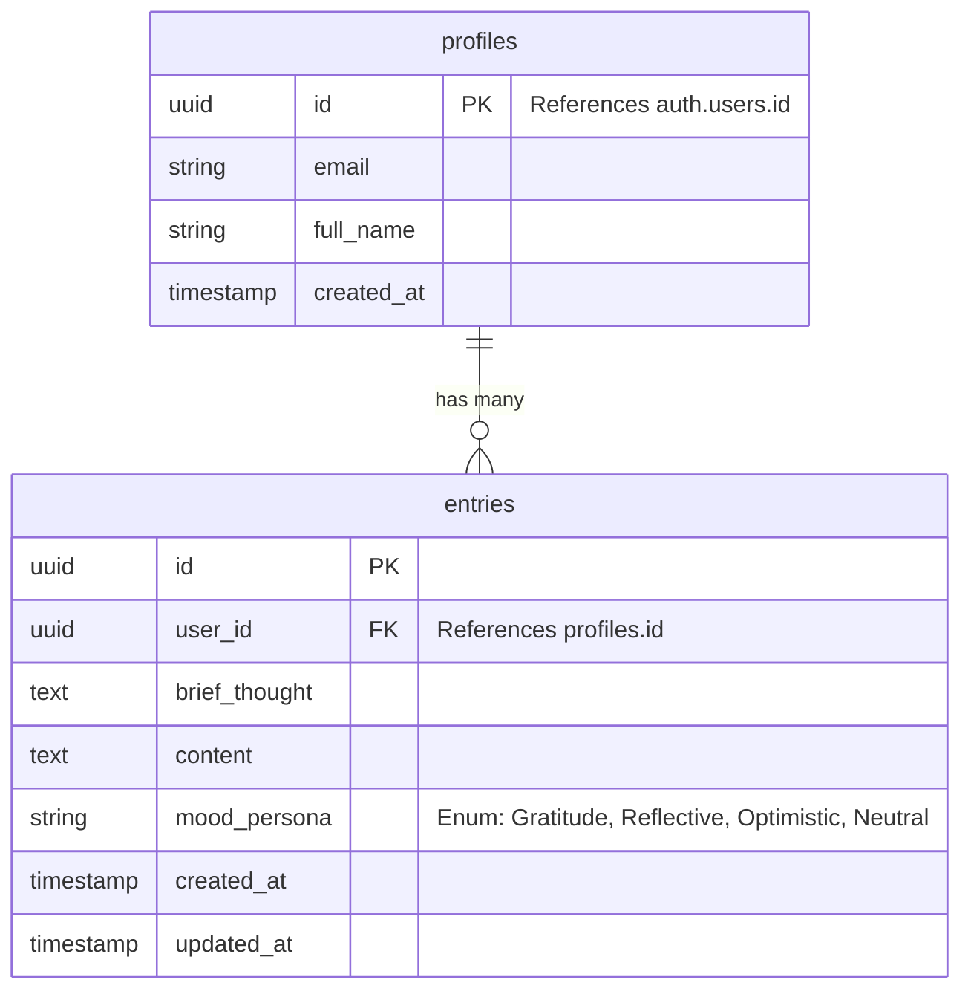

# Data Model: Core MVP

**Feature**: Core MVP Setup
**Status**: Draft

## Overview

The data model uses Supabase (PostgreSQL) to store user profiles and diary entries. Strict Row Level Security (RLS) is enforced to ensure privacy.

## Entity Relationship Diagram (ERD)

## Schema Definitions

### 1. `profiles`

Automatically created via database trigger when a user signs up via `auth.users`.

| Column | Type | Constraints | Description |
|---|---|---|---|
| `id` | `uuid` | PK, FK -> `auth.users.id` | Links to Supabase Auth User. |
| `email` | `text` | NOT NULL | User's email address. |
| `full_name` | `text` | NULLABLE | User's display name (from Google). |
| `created_at` | `timestamptz` | DEFAULT `now()` | Account creation time. |

**RLS Policies**:
- `SELECT`: Users can view their own profile.
- `UPDATE`: Users can update their own profile.

### 2. `entries`

Stores the user's diary entries.

| Column | Type | Constraints | Description |
|---|---|---|---|
| `id` | `uuid` | PK, DEFAULT `gen_random_uuid()` | Unique entry ID. |
| `user_id` | `uuid` | FK -> `profiles.id`, NOT NULL | Owner of the entry. |
| `brief_thought` | `text` | NOT NULL, Max 300 chars | Original input. |
| `content` | `text` | NOT NULL | AI-generated (and edited) full text. |
| `mood_persona` | `text` | DEFAULT 'Neutral' | Tone used for generation. |
| `created_at` | `timestamptz` | DEFAULT `now()` | When the entry was created. |
| `updated_at` | `timestamptz` | DEFAULT `now()` | Last edit time. |

**RLS Policies**:
- `SELECT`: `auth.uid() == user_id` (View own entries only)
- `INSERT`: `auth.uid() == user_id` (Create for self only)
- `UPDATE`: `auth.uid() == user_id` (Edit own entries only)
- `DELETE`: `auth.uid() == user_id` (Delete own entries only)

## Enum Types

### `mood_persona`
- `Gratitude`
- `Reflective`
- `Optimistic`
- `Neutral`
